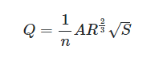

# 2.5. Manning's Equation

In 1889 the Irish engineer Robert Manning presented a formula, which was later modified to its present well-known form,

* Q is discharge measured in m³/s,
* n is Manning's roughness coefficient,
* A is flow area measured in m²,
* R is hydraulic radius measured in m,
* S is channel slope in longitudinal flow direction.

